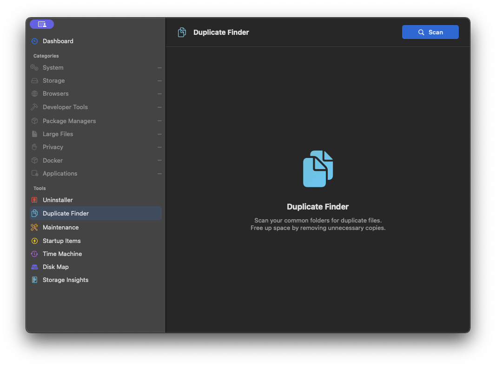
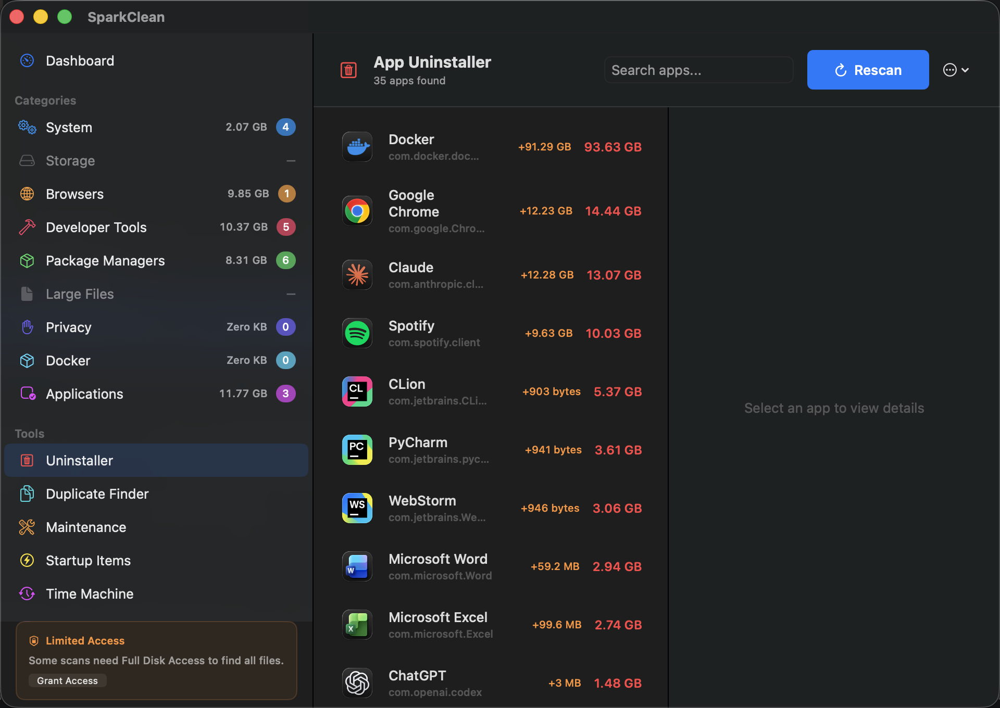

# SparkClean v1.4.0

[](https://github.com/georgekhananaev/spark-clean/releases)
[](LICENSE)
[](https://github.com/georgekhananaev/spark-clean)
[](https://swift.org)
[](https://developer.apple.com/swiftui/)

**Your Mac is hoarding junk. SparkClean finds it and takes out the trash.**

SparkClean is a free, open-source macOS app built with developers in mind. If you work with Docker, Xcode, Node.js, Ollama, JetBrains, Homebrew, or any other dev tools, you know how fast your disk fills up with stuff you didn't even know was there. Dangling Docker images, forgotten Ollama models, abandoned `node_modules`, Xcode DerivedData from three projects ago, stale CocoaPods caches... it adds up fast.

SparkClean scans your system and shows you exactly what's eating your disk space, so you can take it back.

It also covers system caches, old downloads, browser data, duplicate files, and leftover app data.

Built with SwiftUI. No subscriptions. No telemetry.

## Screenshots

### Dashboard

<p>
  
</p>

### Duplicate Finder

<p>
  
</p>

### App Uninstaller

<p>
  
</p>

## Download

Download the latest DMG from [GitHub Releases](https://github.com/georgekhananaev/spark-clean/releases).

Drag it to Applications and you're done.

## Built for Developers

SparkClean pays special attention to the kind of junk that piles up on a developer's machine:

- **Docker** - Dangling images, stopped containers, and reclaimable build cache. Like Docker's prune commands, but with a UI so you can review the category first.
- **Xcode** - DerivedData and simulator caches, plus opt-in archives and device-support files. Simulator devices/runtimes are not removed through raw filesystem cleanup.
- **Node.js** - Forgotten `node_modules` folders scattered across your projects.
- **Ollama** - Downloaded models you're no longer using.
- **JetBrains** - Caches, logs, and local history from IntelliJ, WebStorm, PyCharm, and others.
- **Homebrew** - Old package versions and stale cache files.
- **Package Managers** - CocoaPods, Composer, pip, and other package manager caches.

## What Else It Does

- **Deep Scan** - Goes through caches, logs, reviewable stale temp files, browser data, and more.

- **Smart Categories** - Sorts everything into groups: System, Storage, Browsers, Developer Tools, Package Managers, Docker, and Applications.

- **Safety Levels** - Every category is labeled **Safe**, **Review**, or **Caution** so you know what's safe to delete before you delete it.

- **App Uninstaller** - Finds related preferences, caches, containers, logs, crash reports, and other reviewed leftovers.

- **Duplicate Finder** - Exact duplicates use file size, header comparison, then SHA-256. Visual-similarity groups are clearly marked, kept out of Select All, and require individual review.

- **Large File Hunter** - Finds large files you may have forgotten about.

- **Per-File Selection** - Pick and choose exactly which files to remove. Full control over what gets deleted.

- **Disk Usage Overview** - Visual breakdown of your disk space with reclaimable space highlighted.

- **WhatsApp Storage** - Shows the complete on-disk WhatsApp footprint. Cache and logs are separated from chat media, and the full media store can be explicitly reviewed and moved to Trash without deleting the message database.

- **Export Reports** - Generate summary or detailed audit reports of scan results.

- **Configurable Thresholds** - Adjust what counts as "old," "large," or "unused."

## How Cleanup Works

SparkClean moves files to the Trash by default and records successful moves for Restore Last Cleanup. It reports Trash failures instead of silently falling back to permanent deletion. You'll need to empty the Trash yourself when you're ready.

The latest cleanup scan is also written to `~/Library/Logs/SparkClean/latest-scan.json`
so category sizes and paths can be audited after SparkClean closes. This private local
file is replaced by the next scan.

The exceptions are Docker and Ollama, items already inside Trash, plus Safe/Review categories when permanent-delete mode is explicitly enabled. Docker dangling images, stopped containers, and build cache are removed using Docker's own CLI commands, and Ollama models are deleted through the Ollama CLI. Caution categories always go to the Trash.

## Full Disk Access

SparkClean needs Full Disk Access to scan folders that macOS restricts by default (Mail, Messages, app containers, etc.). Without it, some categories won't return results. You can grant it in **System Settings > Privacy & Security > Full Disk Access**.

## Privacy

Cleanup and analysis run entirely on your Mac. There are no SparkClean accounts, analytics, telemetry, or uploaded scan results. Settings, size history, undo manifests, and deletion audit logs remain local; undo/audit records can contain file paths. The optional update checker contacts GitHub only when you request a check or enable automatic update checks, and downloads a release only to a location you choose.

## Languages

SparkClean supports English, Simplified Chinese, Japanese, German, and Hebrew.
Hebrew uses a native right-to-left layout, while file paths, bundle identifiers,
commands, and URLs remain left-to-right for readability. Choose a language in
**Settings → General → Language**, then restart SparkClean when prompted.

Translations are maintained in `SparkClean/Localizable.xcstrings`. See the
[translation guide](CONTRIBUTING.md#adding-a-translation) to add or improve a language.

## Requirements

- macOS 14.0+
- Xcode 16.0+ (for building from source)

## Build From Source

```bash
git clone https://github.com/georgekhananaev/spark-clean.git
cd spark-clean
open SparkClean.xcodeproj
```

Hit **Cmd+R** in Xcode. No CocoaPods, no SPM dependencies. Just pure Swift.

Or from the terminal:

```bash
xcodebuild -project SparkClean.xcodeproj -scheme SparkClean -configuration Release build
```

## Contributing

See [CONTRIBUTING.md](CONTRIBUTING.md) for guidelines.

## License

See [LICENSE](LICENSE) for the full terms.

## Supported Devices

See [SUPPORTED.md](SUPPORTED.md) for tested devices, OS versions, and compatibility info.

## Changelog

See [CHANGELOG.md](CHANGELOG.md) for a detailed history of changes.

## Author

**George Khananaev**
