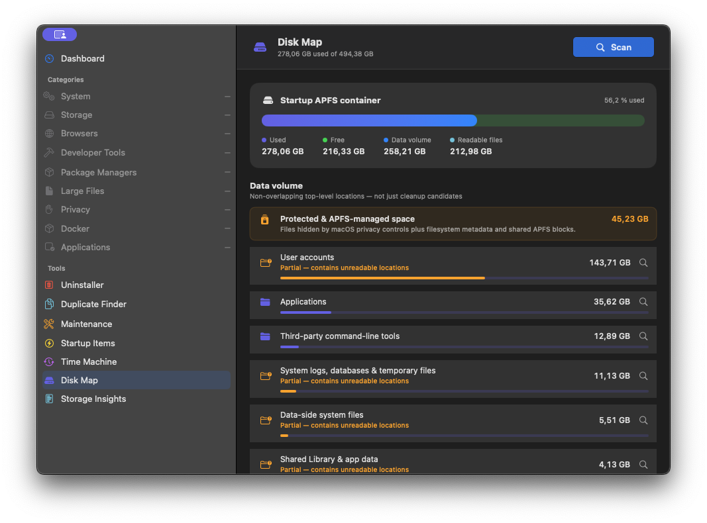
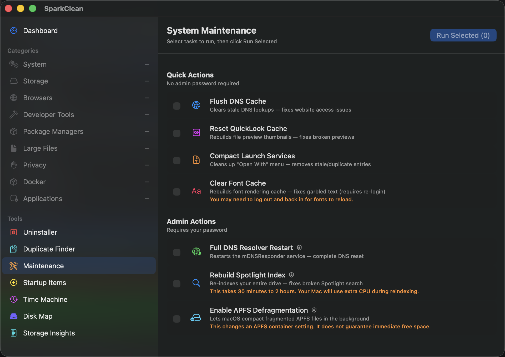
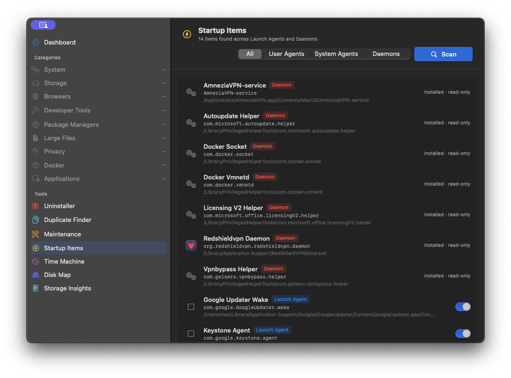
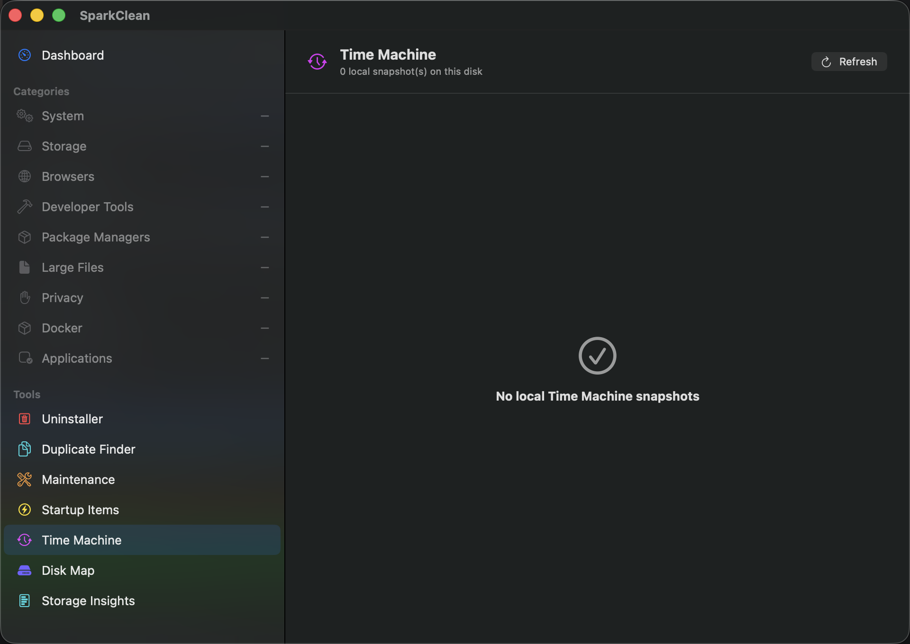
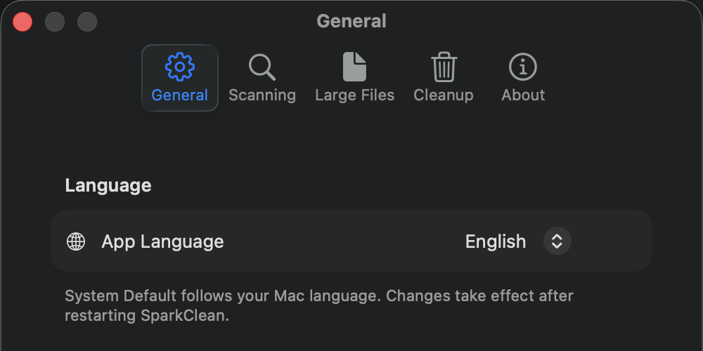
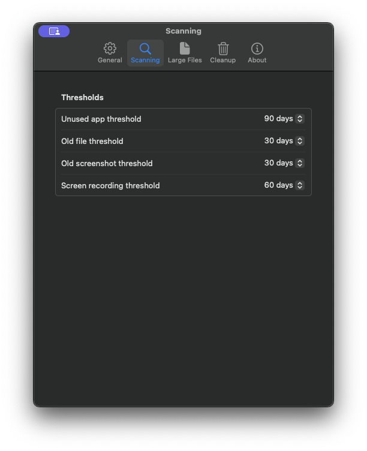
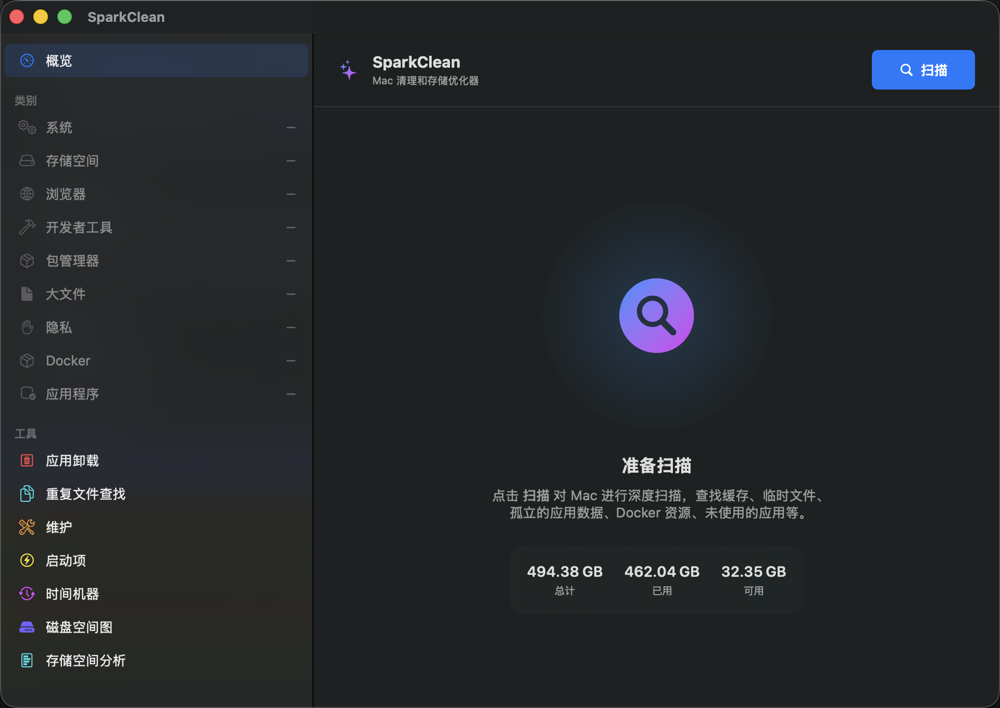

# SparkClean: macOS Disk Cleaner and Storage Analyzer

[](https://github.com/georgekhananaev/spark-clean/releases)
[](https://github.com/georgekhananaev/spark-clean/actions/workflows/build.yml)
[](https://github.com/georgekhananaev/spark-clean/actions/workflows/tests.yml)
[](LICENSE)
[](SUPPORTED.md)
[](https://developer.apple.com/xcode/swiftui/)

[English](README.md) · [简体中文](docs/zh-hans/index.md) · [日本語](docs/ja/index.md) · [Deutsch](docs/de/index.md) · [עברית](docs/he/index.md)

**A review-first Mac cleaner and storage analyzer, built especially for developer machines.**

SparkClean is a native macOS disk cleaner that combines a cache cleaner, storage
analyzer, duplicate file finder, and app uninstaller in one SwiftUI app. It finds
rebuildable caches, stale files, Xcode and `node_modules` artifacts, unused apps, Docker
resources, duplicate files, and other space you may want back. Every result is grouped
by risk, visible before cleanup, and moved to Trash by default.

There are no accounts, subscriptions, analytics, or telemetry. Scanning and cleanup
happen locally on your Mac. SparkClean is source-available and free for personal,
educational, academic, and other non-commercial use under the included
[license](LICENSE).

<p align="center">
  <a href="https://youtu.be/82pBcFR8ODI">
    
  </a>
</p>
<p align="center">
  <a href="https://youtu.be/82pBcFR8ODI"><strong>▶ Watch SparkClean in action on YouTube</strong></a>
</p>

## Quick Start

1. Download the latest DMG from [GitHub Releases](https://github.com/georgekhananaev/spark-clean/releases/latest).
2. Drag **SparkClean** to **Applications**, then open it.
3. Grant Full Disk Access if you want complete coverage of protected locations.
4. Click **Scan**, review the selected categories and paths, then click **Clean**.
5. Empty Trash when you are satisfied, or use **Restore Last Cleanup** first.

You can also open one category in the sidebar and click **Scan _Category Name_**. This
refreshes only that tab instead of running the full scan.

## What SparkClean Includes

| Area | What it does |
| --- | --- |
| Cleanup scan | Finds caches, logs, old downloads and installers, stale temporary files, browser data, app leftovers, large files, unused apps, broken links, and more. |
| Developer cleanup | Covers Xcode, simulators, `node_modules`, Rust targets, Python environments, JetBrains tools, Homebrew, CocoaPods, Composer, pip, npm, Yarn, pnpm, Deno, Bazel, and other common toolchains. |
| Docker and Ollama | Measures reclaimable Docker resources and installed Ollama models, then uses their official CLIs for approved cleanup. |
| App Uninstaller | Finds installed apps and related preferences, caches, containers, logs, crash reports, and support data. Each related location can be reviewed separately. |
| Duplicate Finder | Detects byte-identical files with size, header, and SHA-256 checks. Similar-image suggestions are clearly separated and require individual review. |
| Disk Map | Builds a read-only view of top-level files, user data, protected space, APFS volumes, shared blocks, and container usage. |
| Storage Insights | Tracks the size and change of high-value stores such as chat apps, Photos, Mail, iOS backups, simulators, Docker, and virtual machines. This view is read-only. |
| Time Machine | Lists local APFS snapshots and can remove selected older snapshots through `tmutil`; the newest snapshot is kept as a restore point. |
| Startup Items | Shows user agents, system agents, and daemons. User launch agents can be enabled or disabled explicitly; system agents and daemons remain read-only. |
| Maintenance | Runs selected macOS maintenance actions such as flushing DNS, resetting Quick Look, compacting Launch Services, clearing font caches, rebuilding Spotlight, and enabling APFS defragmentation. |
| Reports and audit records | Exports summary or detailed reports and keeps local scan, storage-map, cleanup, and recovery records. |

For the detailed coverage and deliberate safety exclusions, see
[SUPPORTED.md](SUPPORTED.md).

## Screenshots

<table>
  <tr>
    <td width="50%"><strong>Disk Map</strong></td>
    <td width="50%"><strong>App Uninstaller</strong></td>
  </tr>
  <tr>
    <td></td>
    <td></td>
  </tr>
  <tr>
    <td><strong>Duplicate Finder</strong></td>
    <td><strong>System Maintenance</strong></td>
  </tr>
  <tr>
    <td></td>
    <td></td>
  </tr>
  <tr>
    <td><strong>Startup Items</strong></td>
    <td><strong>Time Machine snapshots</strong></td>
  </tr>
  <tr>
    <td></td>
    <td></td>
  </tr>
</table>

## Safety Model

SparkClean labels every cleanup category before you act:

| Level | Meaning | Selection behavior |
| --- | --- | --- |
| **Safe** | Low-risk caches, logs, and generated files that are expected to rebuild. | Included by **Select Safe Only**. |
| **Review** | User-owned or context-sensitive files such as old downloads, archives, models, and stale project data. | Review the category or individual paths before cleaning. |
| **Caution** | App data or managed stores where removal can affect content or app state. | Never included by **Select All**; requires explicit selection and always goes to Trash. |

Deletion is also restricted at the path level. SparkClean refuses broad home-directory
targets, mounted volumes, cloud-provider storage, protected credential stores, signed
application internals, and paths reached through unsafe symbolic links.

## How Cleanup and Recovery Work

By default, selected files are moved to Trash. SparkClean records successful moves so
the most recent Trash-backed cleanup can be restored with **Shift+Cmd+Z**. Restore it
before emptying Trash; once an item is no longer there, SparkClean cannot recover it.

SparkClean reports Trash failures instead of silently switching to permanent deletion.
If permanent-delete mode is explicitly enabled in Settings, it applies only where the
selected Safe or Review category permits it. Caution categories still go to Trash.

The following operations are not recoverable through Trash:

- Docker resources removed with Docker CLI prune commands.
- Ollama models removed with `ollama rm`.
- Items that were already inside Trash.
- Items removed while explicit permanent-delete mode was enabled.

The final confirmation sheet identifies command-based and permanent exceptions before
cleanup starts.

## Common Workflows

### Clean only developer files

1. Open **Developer Tools** in the sidebar.
2. Click **Scan Developer Tools**.
3. Expand categories such as Xcode DerivedData, `node_modules`, Rust targets, or virtual environments.
4. Deselect any active project data, then clean the remaining selection.

### Find out why the disk is full

1. Open **Disk Map** and click **Analyze Disk** for a read-only APFS overview.
2. Compare user files with protected and APFS-managed space.
3. Use **Reveal in Finder** for a folder you want to inspect.
4. Open **Storage Insights** to check large app-managed stores and their change since the previous measurement.

The cleanup total and the disk's used-space total answer different questions. Cleanup
shows known, reviewable candidates; Disk Map accounts for the wider storage picture.

### Fully review an app before uninstalling it

1. Open **Uninstaller** and click **Scan Apps**, or drag an `.app` into the window.
2. Select the app and inspect every related location.
3. Deselect preferences or support data you want to keep.
4. Confirm **Move to Trash**. The app and only the selected related locations are removed.

### Remove duplicate files safely

1. Open **Duplicate Finder** and click **Scan**.
2. Expand a group and choose which copy to keep.
3. Review similar-image groups one by one; they are suggestions, not exact matches.
4. Click **Clean Selected** to move the approved copies to Trash.

## Permissions

| Permission | Why SparkClean may request it |
| --- | --- |
| Full Disk Access | Required for complete measurement of protected Mail, Messages, Safari, app containers, and similar locations. Without it, SparkClean still works but some results are partial or unavailable. |
| Files and Folders | macOS may ask before SparkClean reads locations such as Desktop, Documents, or Downloads. |
| Automation / administrator approval | Requested only for an operation that needs Finder or a privileged macOS command, including some maintenance actions and local Time Machine snapshot removal. |
| Network access | Used only for optional GitHub release checks and a download you explicitly start. Normal scanning and cleanup work offline. |

Grant Full Disk Access at **System Settings → Privacy & Security → Full Disk Access**,
then quit and reopen SparkClean.

## Privacy and Local Records

SparkClean does not upload file names, paths, scan results, or cleanup history. Local
records can contain paths, so treat them as private when attaching diagnostics to an
issue.

| Location | Contents |
| --- | --- |
| `~/Library/Logs/SparkClean/latest-scan.json` | The latest cleanup scan, including scope, settings, category sizes, and paths. Replaced by the next scan. |
| `~/Library/Logs/SparkClean/latest-storage-map.json` | The latest read-only Disk Map audit. |
| `~/Library/Logs/SparkClean/cleanup-*.log` | Bounded cleanup audit logs describing what was moved, deleted, or removed through a command. |
| `~/Library/Application Support/SparkClean/manifests/` | Restore Last Cleanup manifests for Trash-backed operations. |
| `~/Library/Application Support/SparkClean/insights-history.json` | Daily Storage Insights measurements used to calculate changes over time. |

These records can be removed by deleting the two SparkClean folders above. Do that only
after you no longer need Restore Last Cleanup.

## Settings and Languages

Open Settings with **Cmd+,**. You can configure scan categories, unused-app age, old-file
age, large-file size and locations, cleanup behavior, automatic update checks, the menu
bar item, Trash monitoring, and the app language.

<table>
  <tr>
    <td width="50%"><strong>App language</strong></td>
    <td width="50%"><strong>Scan thresholds</strong></td>
  </tr>
  <tr>
    <td></td>
    <td></td>
  </tr>
</table>

SparkClean includes English, Simplified Chinese, Japanese, German, and Hebrew. Choose
**Settings → General → App Language**, then restart SparkClean when prompted. Hebrew uses
right-to-left text while keeping the sidebar on the familiar left side. File paths,
bundle identifiers, commands, and URLs remain left-to-right for readability.

### Help Improve the Translations

Most non-English strings were initially produced with AI-assisted translation. They are
a useful starting point, but they may contain wording that feels too literal, misses the
technical context, or is not how a native speaker would describe something in a Mac app.

If you speak one of the included languages, your corrections are welcome. You do not
need to review the entire app: improving a single button, sentence, or technical term is
still a valuable contribution. You can edit `SparkClean/Localizable.xcstrings` and open
a pull request, or [open an issue](https://github.com/georgekhananaev/spark-clean/issues/new)
with the language, current text, and suggested replacement if you do not use Xcode.
The complete workflow is documented in the
[Translation Contribution Guide](docs/TRANSLATIONS.md).

<table>
  <tr>
    <td width="50%"><strong>Simplified Chinese</strong></td>
    <td width="50%"><strong>Japanese</strong></td>
  </tr>
  <tr>
    <td></td>
    <td></td>
  </tr>
  <tr>
    <td><strong>German</strong></td>
    <td><strong>Hebrew with right-to-left text</strong></td>
  </tr>
  <tr>
    <td></td>
    <td></td>
  </tr>
</table>

Translations live in `SparkClean/Localizable.xcstrings`. See the
[Translation Contribution Guide](docs/TRANSLATIONS.md) to add or improve a language.

## Keyboard Shortcuts

| Shortcut | Action |
| --- | --- |
| **Cmd+R** | Scan |
| **Cmd+E** | Export report |
| **Shift+Cmd+A** | Select all except Caution categories |
| **Shift+Cmd+D** | Deselect all |
| **Shift+Cmd+S** | Select Safe only |
| **Shift+Cmd+Z** | Restore Last Cleanup |
| **Cmd+?** | Open SparkClean Help |
| **Cmd+,** | Open Settings |

## FAQ

### Why did free space not increase immediately after cleanup?

Files moved to Trash still occupy disk space. Empty Trash when you are sure you do not
need to restore them.

### Why is a category empty or missing?

The related app or tool may not be installed, nothing matched the configured threshold,
the scan may have been canceled, or macOS may have blocked a protected location. Check
the partial-scan notice and Full Disk Access status, then rescan that category.

### Can SparkClean remove cloud files or external-drive data?

No. SparkClean deliberately excludes `~/Library/CloudStorage`, iCloud's
`~/Library/Mobile Documents`, mounted volumes, and file-provider items from cleanup.

### Are Startup Items changed by the app?

User launch agents can be enabled or disabled with their individual switch. System
agents and daemons are shown for inspection but remain read-only.

### Does Storage Insights delete anything?

No. It measures selected app-managed stores and records daily size history. Cleanup is
available only through an explicit cleanup category or tool with its own confirmation.

## Requirements

- macOS 14.0 Sonoma or later.
- Apple Silicon or Intel Mac.
- Xcode 26 with Swift 6.2 or later when building from source.

See [SUPPORTED.md](SUPPORTED.md) for tested hardware and compatibility details.

## Build From Source

SparkClean has no CocoaPods or Swift Package Manager dependencies.

```bash
git clone https://github.com/georgekhananaev/spark-clean.git
cd spark-clean
open SparkClean.xcodeproj
```

Run the **SparkClean** scheme from Xcode, or build from Terminal:

```bash
xcodebuild \
  -project SparkClean.xcodeproj \
  -scheme SparkClean \
  -configuration Debug \
  -destination 'platform=macOS' \
  build
```

Run the unit tests with:

```bash
xcodebuild test \
  -project SparkClean.xcodeproj \
  -scheme SparkClean \
  -destination 'platform=macOS' \
  -only-testing:SparkCleanTests
```

## Contributing and Support

- Read [CONTRIBUTING.md](CONTRIBUTING.md) before opening a pull request.
- Report bugs or request features in [GitHub Issues](https://github.com/georgekhananaev/spark-clean/issues).
- Review release history in [CHANGELOG.md](CHANGELOG.md).

## Documentation

- [Web and multilingual product overview](docs/index.md)
- [Supported cleanup coverage and safety exclusions](SUPPORTED.md)
- [Translation contribution guide](docs/TRANSLATIONS.md)
- [Release, signing, notarization, and Homebrew notes](docs/RELEASE.md)

## License

SparkClean is available under the [SparkClean Non-Commercial Open Source License](LICENSE).
Commercial use, redistribution through an app store or marketplace, and other uses
outside the license require permission from George Khananaev.

## Author

**George Khananaev**
