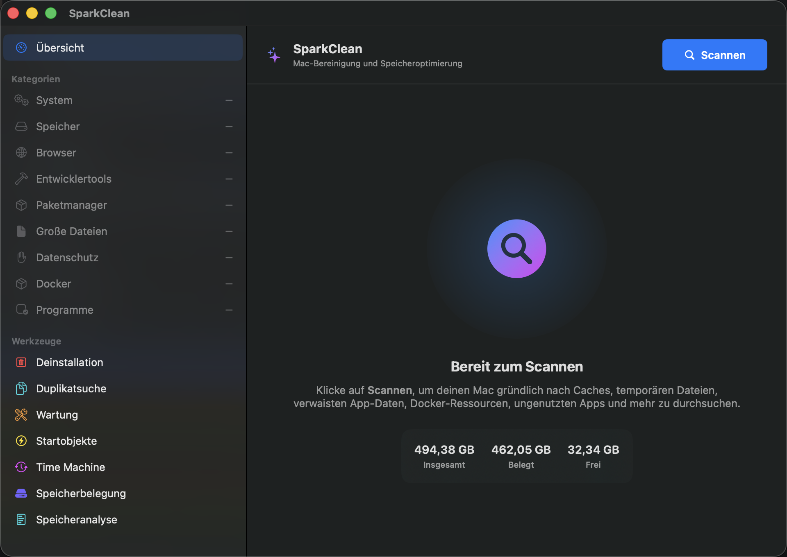

Native SwiftUI-App für macOS 14 und neuer

# Mehr Platz auf dem Mac, ohne auf Verdacht zu löschen

Entwicklerwerkzeuge sammeln Daten mit beeindruckender Ausdauer. Beim Aufräumen sind sie weniger gründlich. SparkClean zeigt Xcode-, Docker- und <code>node_modules</code>-Daten, Caches, doppelte Dateien und App-Reste, bevor du entscheidest, was weg kann.

  <a class="button primary" href="https://github.com/georgekhananaev/spark-clean/releases/latest">Neueste Version laden</a>
  <a class="button" href="https://github.com/georgekhananaev/spark-clean">Quellcode auf GitHub ansehen</a>

## Aufräumen, was Entwicklerwerkzeuge liegen lassen

SparkClean vereint Cache-Bereinigung, Speicheranalyse, Duplikatsuche und App-Deinstallation
in einer nativen Mac-App. Jeder Bereich lässt sich einzeln scannen. Wer nur Docker prüfen
will, muss nicht auf einen kompletten Systemscan warten.

  <article class="feature-card">
    <h3>Entwickler-Caches an einem Ort</h3>
    
Xcode DerivedData und Simulatoren, Docker-Ressourcen, node_modules, Homebrew, JetBrains, Python-Umgebungen, Rust-target-Ordner und Caches gängiger Paketmanager prüfen.

  </article>
  <article class="feature-card">
    <h3>Sehen, wohin der Speicherplatz verschwindet</h3>
    
Festplattenübersicht und Speicheranalyse arbeiten schreibgeschützt. Sie zeigen große Ordner, App-Daten, APFS-Volumes, lokale Schnappschüsse und Veränderungen beim Speicherverbrauch.

  </article>
  <article class="feature-card">
    <h3>Doppelte Dateien und App-Reste</h3>
    
Inhaltsgleiche Dateien werden mit SHA-256 bestätigt. Beim Entfernen einer App lassen sich Caches, Einstellungen, Container, Protokolle und Supportdateien einzeln behalten oder auswählen.

  </article>
  <article class="feature-card">
    <h3>Erst ansehen, dann löschen</h3>
    
Funde sind als Sicher, Prüfen oder Vorsicht gekennzeichnet. SparkClean zeigt die Pfade, lässt geschützte Orte in Ruhe und verschiebt bestätigte Dateien standardmäßig in den Papierkorb.

  </article>

## Alles bleibt auf dem Mac

Scans, Analysen und Bereinigungen laufen lokal. SparkClean braucht kein Konto und verwendet
weder Abos noch Werbung, Nutzungsanalyse oder Telemetrie. Dateinamen, Pfade, Scanergebnisse
und der Bereinigungsverlauf werden nicht hochgeladen. Eine Verbindung nach außen gibt es nur
für die optionale GitHub-Versionsprüfung und für Downloads, die du selbst startest.

  
<strong>Ein Rückweg bleibt offen.</strong> Solange der Papierkorb nicht geleert wurde, lässt sich die letzte Bereinigung über den Papierkorb mit <strong>Umschalt+Cmd+Z</strong> wiederherstellen. Nicht wiederherstellbare Befehle wie Docker-Pruning werden vor der Bestätigung klar getrennt angezeigt.

## Fünf Sprachen, direkt in der App

SparkClean enthält Englisch, vereinfachtes Chinesisch, Japanisch, Deutsch und Hebräisch.
Die Auswahl findest du unter **Einstellungen → Allgemein → App-Sprache**. Danach startet
die App auf Wunsch neu.

Viele nicht englische Texte entstanden zunächst mit KI-Unterstützung. Das ist eine
Arbeitsgrundlage, kein Qualitätsstempel. Wenn eine Formulierung steif klingt, fachlich nicht
passt oder einfach niemand so sagen würde, ist auch die Korrektur eines einzigen Satzes
willkommen. Der
[Leitfaden für Übersetzungsbeiträge](https://github.com/georgekhananaev/spark-clean/blob/main/docs/TRANSLATIONS.md)
erklärt den Ablauf.

## Häufige Fragen

### Was räumt SparkClean auf?

Die App findet neu erzeugbare Caches, Protokolle, temporäre Daten, alte Installationsdateien,
Entwicklungsartefakte, lange ungenutzte Apps und App-Reste. Was unterstützt und aus
Sicherheitsgründen bewusst ausgelassen wird, steht in der
[Funktionsübersicht](https://github.com/georgekhananaev/spark-clean/blob/main/SUPPORTED.md).

### Ist SparkClean Open Source?

Der vollständige Quellcode lässt sich einsehen und ändern. Private, schulische, akademische
und andere nicht kommerzielle Nutzung ist im Rahmen der nicht kommerziellen Lizenz kostenlos.
SparkClean ist source-available, aber keine OSI-anerkannte Open-Source-Software.

### Lässt sich eine Bereinigung rückgängig machen?

Ausgewählte Dateien landen standardmäßig im Papierkorb. Solange er nicht geleert wurde,
kann die letzte Bereinigung wiederhergestellt werden. Dauerhaftes Löschen muss ausdrücklich
aktiviert werden und bleibt durch Kategorie- und Pfadregeln eingeschränkt.

### Welche Macs werden unterstützt?

Benötigt wird macOS 14 Sonoma oder neuer. Macs mit Apple-Chip und Intel-Macs werden unterstützt.

## Download, Dokumentation und Hilfe

<ul class="link-list">
  <li><a href="https://github.com/georgekhananaev/spark-clean/releases/latest">SparkClean über GitHub Releases laden</a></li>
  <li><a href="https://github.com/georgekhananaev/spark-clean/blob/main/README.md">Vollständige Anleitung und Bildschirmfotos ansehen</a></li>
  <li><a href="https://github.com/georgekhananaev/spark-clean/issues">Fehler melden oder eine Funktion vorschlagen</a></li>
  <li><a href="https://github.com/georgekhananaev/spark-clean/blob/main/CONTRIBUTING.md">Code, Dokumentation oder Übersetzungen beitragen</a></li>
</ul>
