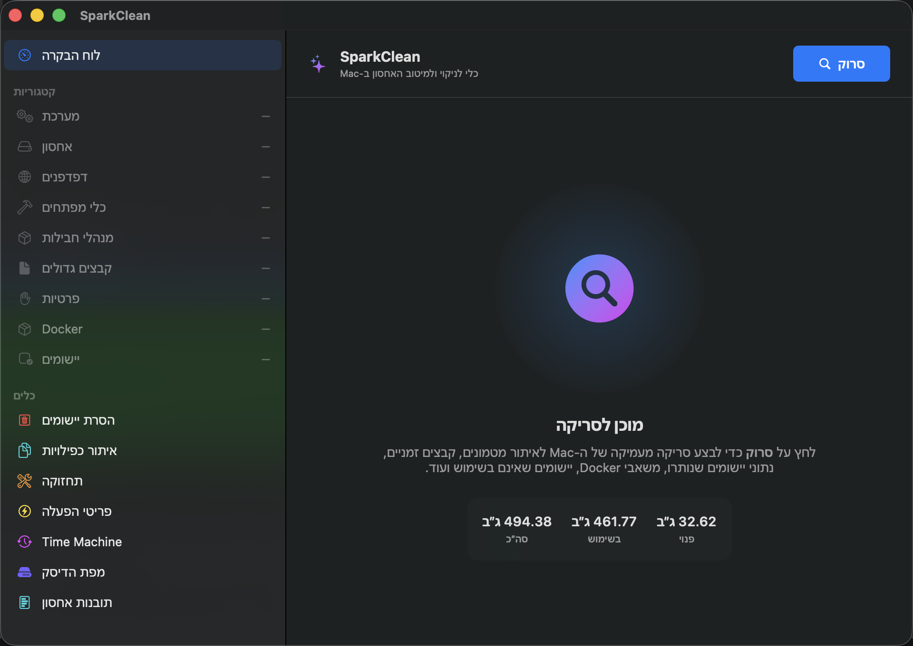

כלי macOS מקורי למפתחים, מגרסה 14 ומעלה

<h1 dir="rtl">מפנים מקום ב‑Mac בלי למחוק סתם</h1>

כלי פיתוח יודעים לתפוס המון מקום. לנקות אחריהם? קצת פחות. SparkClean מראה כמה מקום תופסים כלים כמו Xcode, Docker ו‑node_modules, יחד עם מטמונים, קבצים כפולים ושאריות של יישומים. לפני שמנקים, רואים בדיוק מה עומד להימחק.

  <a class="button primary" href="https://github.com/georgekhananaev/spark-clean/releases/latest">הורדת הגרסה האחרונה</a>
  <a class="button" href="https://github.com/georgekhananaev/spark-clean">צפייה בקוד ב‑GitHub</a>

<h2 dir="rtl">מנקים את מה שכלי הפיתוח משאירים</h2>

SparkClean מרכז ביישום Mac מקורי אחד ניקוי מטמונים, ניתוח שטח אחסון, איתור קבצים כפולים והסרה של יישומים. אפשר לסרוק כל אזור בנפרד, כך שלא צריך להמתין לסריקה מלאה רק כדי לבדוק את Docker.

  <article class="feature-card">
    <h3>מטמונים של כלי פיתוח, במקום אחד</h3>
    
בדיקה של Xcode DerivedData וסימולטורים, משאבי Docker, תיקיות node_modules, Homebrew, JetBrains, סביבות Python, תיקיות target של Rust ומטמונים של מנהלי חבילות.

  </article>
  <article class="feature-card">
    <h3>רואים לאן נעלם המקום</h3>
    
מפת הדיסק וניתוח האחסון פועלים לקריאה בלבד. הם מציגים תיקיות גדולות, נתוני יישומים, אמצעי אחסון מסוג APFS, תמונות מצב מקומיות ושינויים בצריכת שטח האחסון.

  </article>
  <article class="feature-card">
    <h3>כפילויות ושאריות של יישומים</h3>
    
קבצים זהים מאומתים באמצעות SHA-256. בהסרת יישום אפשר לבחור בנפרד אם להשאיר או להסיר את המטמונים, ההעדפות, הקונטיינרים, קובצי היומן וקובצי התמיכה שלו.

  </article>
  <article class="feature-card">
    <h3>קודם בודקים, אחר כך מנקים</h3>
    
התוצאות מסומנות כ״בטוח״, ״לבדיקה״ או ״זהירות״. SparkClean מציג את הנתיבים, לא נוגע במיקומים מוגנים ומעביר כברירת מחדל את הקבצים שאושרו לפח האשפה.

  </article>

<h2 dir="rtl">הקבצים נשארים ב‑Mac</h2>

הסריקה, הניתוח והניקוי מתבצעים באופן מקומי. SparkClean לא דורש חשבון, ואין בו מנוי, פרסומות, ניתוח שימוש או טלמטריה. שמות קבצים, נתיבים, תוצאות סריקה והיסטוריית ניקוי לא נשלחים לשום מקום. החיבור לרשת משמש רק לבדיקה אופציונלית של גרסה חדשה ב‑GitHub ולהורדה שהפעלת בעצמך.

  
<strong>אפשר גם להתחרט.</strong> כל עוד פח האשפה לא רוקן, אפשר לשחזר את הניקוי האחרון באמצעות <strong>Shift+Cmd+Z</strong>. פעולות שלא ניתן לשחזר, כמו ניקוי Docker באמצעות פקודה, מסומנות בבירור לפני האישור.

<h2 dir="rtl">חמש שפות, ועברית מימין לשמאל</h2>

SparkClean כולל אנגלית, סינית מפושטת, יפנית, גרמנית ועברית. הטקסט בעברית מוצג מימין לשמאל, וסרגל הצד של היישום נשאר בצד שמאל. כדי להחליף שפה, פותחים את <strong>הגדרות</strong>, עוברים אל <strong>כללי</strong> ובוחרים <strong>שפת היישום</strong>. לאחר מכן מפעילים מחדש לפי ההודעה.

רוב הטקסטים שאינם באנגלית התחילו מתרגום בסיוע AI. זו נקודת פתיחה, לא המילה האחרונה. אם משפט נשמע מתורגם מדי, מונח טכני לא מתאים להקשר או שפשוט לא מדברים ככה, נשמח גם לתיקון של שורה אחת. ההוראות נמצאות <a href="https://github.com/georgekhananaev/spark-clean/blob/main/docs/TRANSLATIONS.md">במדריך לתרומה לתרגומים</a>.

<h2 dir="rtl">שאלות נפוצות</h2>

<h3 dir="rtl">מה SparkClean יודע לנקות?</h3>

היישום מאתר מטמונים שאפשר ליצור מחדש, קובצי יומן, נתונים זמניים, מתקינים ישנים, תוצרי פיתוח, יישומים שלא היו בשימוש זמן רב ושאריות של יישומים. הרשימה המלאה, כולל המקומות שלא נוגעים בהם בכוונה, נמצאת <a href="https://github.com/georgekhananaev/spark-clean/blob/main/SUPPORTED.md">במסמך התמיכה</a>.

<h3 dir="rtl">האם SparkClean הוא קוד פתוח?</h3>

אפשר לעיין בקוד המקור המלא ולשנות אותו. השימוש חינם למטרות אישיות, לימודיות, אקדמיות ואחרות שאינן מסחריות, בהתאם לרישיון הלא מסחרי. זהו מיזם שקוד המקור שלו זמין, אך הוא אינו תוכנת קוד פתוח שאושרה על ידי OSI.

<h3 dir="rtl">מחקתי משהו בטעות. אפשר לחזור אחורה?</h3>

כברירת מחדל, הקבצים שנבחרו עוברים לפח האשפה. כל עוד הוא לא רוקן, אפשר לשחזר את הניקוי האחרון. מחיקה לצמיתות דורשת הפעלה מפורשת בהגדרות, וגם אז חלים כללי הבטיחות של הקטגוריות והנתיבים.

<h3 dir="rtl">על אילו מחשבי Mac זה עובד?</h3>

נדרש macOS 14 Sonoma ומעלה. קיימת תמיכה במחשבי Mac עם Apple silicon ובמחשבי Mac מבוססי Intel.

<h2 dir="rtl">הורדה, תיעוד ותמיכה</h2>

<ul class="link-list" dir="rtl">
  <li><a href="https://github.com/georgekhananaev/spark-clean/releases/latest">הורדת SparkClean מ‑GitHub Releases</a></li>
  <li><a href="https://github.com/georgekhananaev/spark-clean/blob/main/README.md">המדריך המלא וצילומי המסך</a></li>
  <li><a href="https://github.com/georgekhananaev/spark-clean/issues">דיווח על תקלה או הצעה לתכונה חדשה</a></li>
  <li><a href="https://github.com/georgekhananaev/spark-clean/blob/main/CONTRIBUTING.md">תרומה של קוד, תיעוד או תרגום</a></li>
</ul>
