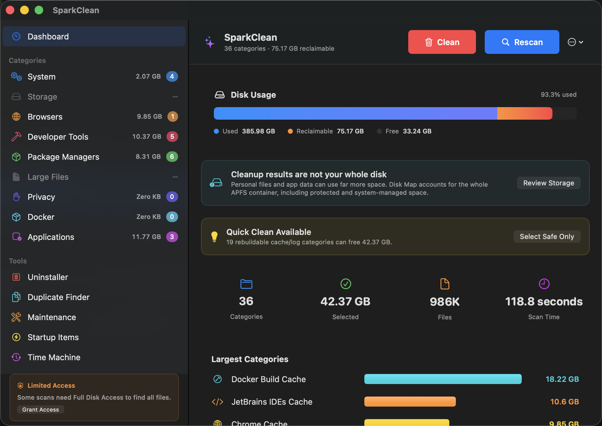

Native SwiftUI utility for macOS 14 and later

# Reclaim Mac storage without blind deletion

SparkClean is a review-first macOS disk cleaner and storage analyzer for developer machines. Find Xcode, Docker, <code>node_modules</code>, caches, duplicate files, app leftovers, and other disk usage before deciding what to remove.

  <a class="button primary" href="https://github.com/georgekhananaev/spark-clean/releases/latest">Download the latest release</a>
  <a class="button" href="https://github.com/georgekhananaev/spark-clean">View the source</a>

## Clean the files developer tools leave behind

SparkClean brings a Mac cache cleaner, disk-space analyzer, duplicate file finder, and
application uninstaller into one native app. Each operation has a focused scan so you
can refresh one area without waiting for a full-system scan.

  <article class="feature-card">
    <h3>Developer cache cleanup</h3>
    
Inspect Xcode DerivedData and simulators, Docker resources, node_modules, Homebrew, JetBrains, Python environments, Rust targets, package-manager caches, and more.

  </article>
  <article class="feature-card">
    <h3>Disk and storage analysis</h3>
    
Use the read-only Disk Map and Storage Insights views to understand large folders, app-managed stores, APFS volumes, snapshots, and changing disk usage.

  </article>
  <article class="feature-card">
    <h3>Duplicate finder and uninstaller</h3>
    
Find byte-identical files with SHA-256 checks, or uninstall a Mac app after reviewing each related cache, preference, container, log, and support folder.

  </article>
  <article class="feature-card">
    <h3>Review-first cleanup</h3>
    
Results are labeled Safe, Review, or Caution. SparkClean shows paths before cleanup, excludes protected locations, and moves approved files to Trash by default.

  </article>

## Private by design

Scanning, storage analysis, and cleanup happen on your Mac. SparkClean has no accounts,
subscriptions, advertising, analytics, or telemetry. It does not upload file names,
paths, scan results, or cleanup history. Network access is used only for an optional
GitHub release check and a download you explicitly start.

  
<strong>Recovery is built in.</strong> Trash-backed cleanup records can be restored with <strong>Shift+Cmd+Z</strong> before Trash is emptied. Command-based cleanup, such as Docker pruning, is identified separately before confirmation.

## Available in five languages

SparkClean includes English, Simplified Chinese, Japanese, German, and Hebrew. Hebrew
uses right-to-left text while keeping the app sidebar on the left. Change the language
under **Settings → General → App Language** and restart when prompted.

Most non-English strings began as AI-assisted translations. Fluent and native speakers
are invited to correct a single phrase, review an existing language, or add another one.
See the
[translation contribution guide](https://github.com/georgekhananaev/spark-clean/blob/main/docs/TRANSLATIONS.md)
for the complete workflow.

## Frequently asked questions

### What can SparkClean safely clean?

SparkClean detects rebuildable caches, logs, temporary data, old installers, development
artifacts, unused apps, app leftovers, and other reviewable files. The exact coverage
and deliberate exclusions are listed in the
[supported-features document](https://github.com/georgekhananaev/spark-clean/blob/main/SUPPORTED.md).

### Is SparkClean open source?

The complete source is available to inspect and modify. SparkClean is free for personal,
educational, academic, and other non-commercial use under its
[non-commercial license](https://github.com/georgekhananaev/spark-clean/blob/main/LICENSE).
It is source-available rather than OSI-approved open source.

### Does SparkClean permanently delete files?

The default is to move selected files to Trash. Permanent deletion must be explicitly
enabled and is still restricted by category and path-safety rules. Caution categories
always go to Trash.

### Which Macs are supported?

SparkClean requires macOS 14 Sonoma or later and supports Apple Silicon and Intel Macs.
The app is built with Swift and SwiftUI and has no third-party runtime dependencies.

## Download, documentation, and support

<ul class="link-list">
  <li><a href="https://github.com/georgekhananaev/spark-clean/releases/latest">Download SparkClean from GitHub Releases</a></li>
  <li><a href="https://github.com/georgekhananaev/spark-clean/blob/main/README.md">Read the complete user guide and screenshot gallery</a></li>
  <li><a href="https://github.com/georgekhananaev/spark-clean/issues">Report a bug or request a feature</a></li>
  <li><a href="https://github.com/georgekhananaev/spark-clean/blob/main/CONTRIBUTING.md">Contribute code, documentation, or a translation</a></li>
</ul>
