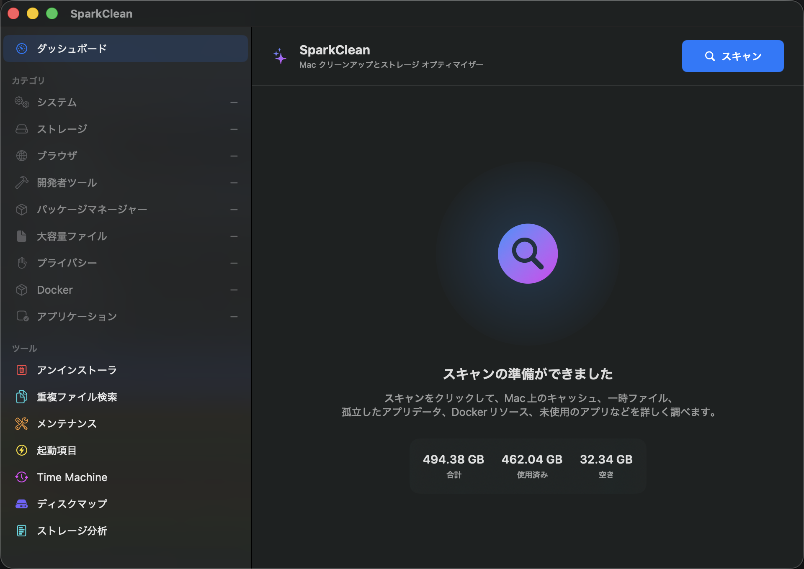

macOS 14以降で動くネイティブSwiftUIアプリ

# Macの空き容量、勘で消さずに取り戻す

開発ツールは容量を使うのは得意でも、片付けまではしてくれません。SparkCleanなら、Xcode、Docker、<code>node_modules</code>、キャッシュ、重複ファイル、アプリの残り物を見つけて、消す前に一つずつ確認できます。

  <a class="button primary" href="https://github.com/georgekhananaev/spark-clean/releases/latest">最新版をダウンロード</a>
  <a class="button" href="https://github.com/georgekhananaev/spark-clean">GitHubでソースを見る</a>

## 開発ツールがため込んだデータをまとめて確認

SparkCleanは、キャッシュの整理、ストレージ分析、重複ファイル検索、アプリの
アンインストールを一つのネイティブMacアプリにまとめています。見たい機能だけ
個別にスキャンできるので、毎回すべてが終わるのを待つ必要はありません。

  <article class="feature-card">
    <h3>開発キャッシュをまとめて確認</h3>
    
Xcode DerivedDataとシミュレータ、Dockerリソース、node_modules、Homebrew、JetBrains、Python環境、Rustのtarget、各種パッケージマネージャのキャッシュを確認できます。

  </article>
  <article class="feature-card">
    <h3>何が容量を使っているか分かる</h3>
    
読み取り専用の「ディスクマップ」と「ストレージインサイト」で、大きなフォルダ、アプリのデータ、APFSボリューム、ローカルスナップショット、容量の変化を把握できます。

  </article>
  <article class="feature-card">
    <h3>重複ファイルとアプリの残り物</h3>
    
SHA-256で内容が同じファイルを確認します。アプリを削除するときは、キャッシュ、設定、コンテナ、ログ、サポートファイルを一つずつ残すか選べます。

  </article>
  <article class="feature-card">
    <h3>消す前に、ちゃんと見る</h3>
    
結果は「安全」「要確認」「注意」に分類されます。パスを先に表示し、保護された場所を除外したうえで、確認したファイルだけを標準ではゴミ箱へ移動します。

  </article>

## データはMacの中だけ

スキャン、分析、クリーンアップはMac上で完結します。アカウント、サブスクリプション、
広告、利用状況の解析、テレメトリはありません。ファイル名、パス、スキャン結果、
履歴もアップロードしません。通信するのは、任意のGitHubリリース確認と、自分で
開始したダウンロードだけです。

  
<strong>やり直せる余地も残しています。</strong> ゴミ箱を空にする前なら、<strong>Shift+Cmd+Z</strong>で直前のクリーンアップを復元できます。Dockerの整理など、コマンドで実行して元に戻せない処理は、確認前にはっきり区別します。

## 5つの言語に対応

英語、簡体字中国語、日本語、ドイツ語、ヘブライ語を収録しています。
**設定 → 一般 → アプリの言語** で選び、案内に従ってアプリを再起動してください。

英語以外の文章は、多くがAI支援の翻訳から始まりました。それで完成とは考えて
いません。不自然な言い回し、技術的にずれた用語、Macらしくない表現があれば、
一文だけの修正でも歓迎します。詳しくは
[翻訳コントリビューションガイド](https://github.com/georgekhananaev/spark-clean/blob/main/docs/TRANSLATIONS.md)をご覧ください。

## よくある質問

### SparkCleanは何を整理できますか？

再生成できるキャッシュ、ログ、一時データ、古いインストーラ、開発時の生成物、
長く使っていないアプリ、アプリの残り物などを検出します。対象範囲と、あえて
触らない場所は
[対応機能の一覧](https://github.com/georgekhananaev/spark-clean/blob/main/SUPPORTED.md)にまとめています。

### SparkCleanはオープンソースですか？

ソースコード全体を閲覧、変更できます。個人、教育、学術、その他の非商用利用は、
非商用ライセンスの範囲で無料です。OSI認定のオープンソースではなく、
ソースアベイラブルのソフトウェアです。

### 間違えて消したら戻せますか？

標準では、選んだファイルをゴミ箱へ移動します。ゴミ箱を空にする前なら、直前の
クリーンアップを復元できます。完全削除は設定で明示的に有効にする必要があり、
有効にしてもカテゴリとパスの安全ルールが適用されます。

### どのMacで使えますか？

macOS 14 Sonoma以降が必要です。AppleシリコンMacとIntel Macの両方に対応します。

## ダウンロード、ドキュメント、サポート

<ul class="link-list">
  <li><a href="https://github.com/georgekhananaev/spark-clean/releases/latest">GitHub ReleasesからSparkCleanをダウンロード</a></li>
  <li><a href="https://github.com/georgekhananaev/spark-clean/blob/main/README.md">詳しい使い方とスクリーンショットを見る</a></li>
  <li><a href="https://github.com/georgekhananaev/spark-clean/issues">不具合を報告する、または機能を提案する</a></li>
  <li><a href="https://github.com/georgekhananaev/spark-clean/blob/main/CONTRIBUTING.md">コード、ドキュメント、翻訳に協力する</a></li>
</ul>
